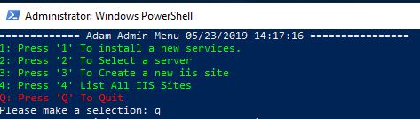

<h1>Powershell</h1>

  

<h2>Information</h2>

<strong>Installation</strong>

On windows if you have install git run the following command:   
<code>git clone https://github.com/livemonkey1300/Super-PowerShell.git </code>  
If git is not install on you PC please copy paste the following link into your browser or click on the link bellow
<a href="https://github.com/livemonkey1300/Super-PowerShell/archive/master.zip">https://github.com/livemonkey1300/Super-PowerShell/archive/master.zip</a>

 
 
<strong>Usage</strong>
<ul>
<li>

1 : Open a command prompt and navigate to the directory created by eiter extrating the file or pulling this repo Type the following command  
<code style="background: #002456;color: white;" >powershell.exe </code>  
Make sure you located in the correct directory  

</li>
<li>
  

  2 : Type the following command to access you tool menu  
  <code style="background: #002456;color: white;">PS C:\Users\ > <strong>.\Basic_sets.ps1</strong></code>  
  The menu from the the image should pop up 
  

  </li>
<li>
  

  3 : Select one of the option from the menu

  </li>
<li>
  

  4 : To exit the tool type q in the main menu

  
 
</li></ul>

 

  <strong>Option 1 : Install New Services</strong>

Description:

By selecting option one , a panel will open showing all the windows feature not currently installed

by selecting one of the option , all the sub-feature from that services and management tools will be installed.

&nbsp;

<strong>Option 2 : Select a server </strong>

Description:

This option contains no option yet it's a beta

&nbsp;

<strong>Option 3 : Create New IIS Sites</strong>

Requirement:

Windows DNS feature install on the current operation system

Windows IIS feature install on the current operation system 

Description:

This options setup a new website inside the default app pool

In the process a new directory located in C:\inetpub\wwwroot\ will be created with the name of your domain

Finally, a DNS zone with an A record will be created on the local DNS server, pointing to localhost 127.0.0.1 where local website testing can be conduct 

&nbsp;

<strong>Option 4 : List IIS Sites</strong>

Description:

This option will only list the site currently available on the server

&nbsp;

&nbsp;

<h1>Warning</h1>

This is not a fully completed powershell , in no case it should be use withing an infrastucture until completion , or  if it's modify by system addriminstator. it's still in the beta phase

